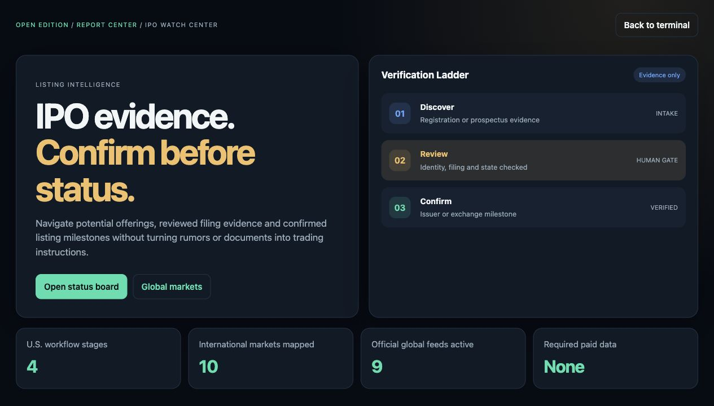
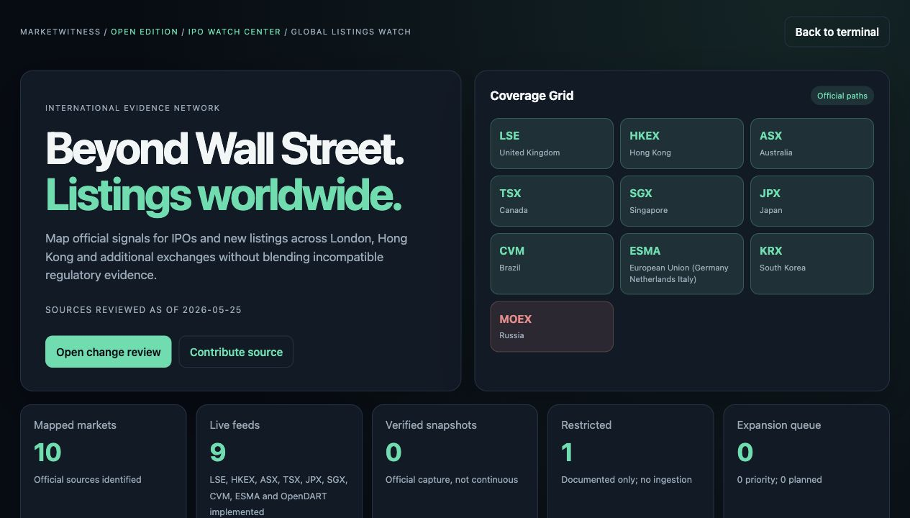
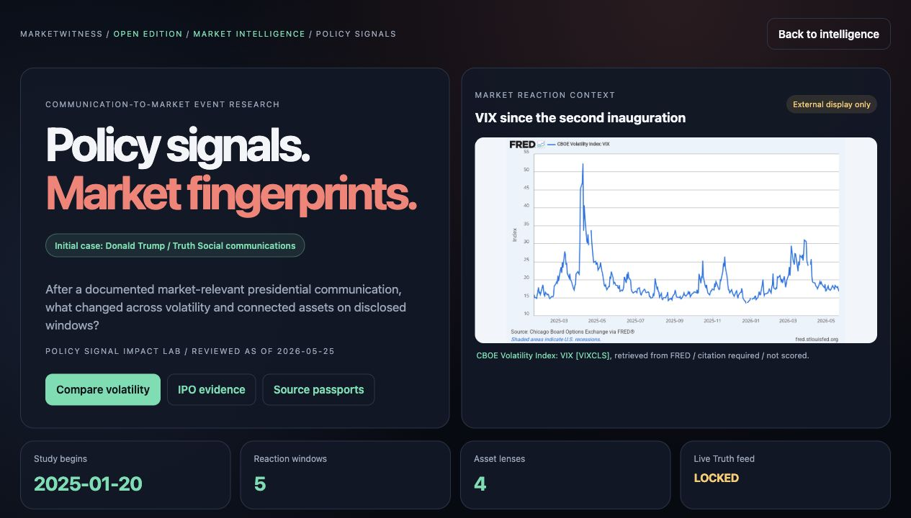

# MarketWitness

**Evidence-first market intelligence for public listings, analyst research,
volatility, ETF evidence, and presidential communication research.**

`v0.1.0-rc.1` | Open Edition | MIT licensed | No paid data required | Responsive dashboard

MarketWitness is an open-source research system built around a simple rule:
market claims should be traceable to evidence, permissions, and explicit
claim boundaries. It ships a navigable dashboard, read-only API, reproducible
reports, public-regulatory workflows, and synthetic demonstrations that run
without a paid data subscription.

It is not a trading-signal product and does not currently publish real analyst
rankings. A real scorecard is deliberately held behind documented data rights,
per-observation provenance, and release controls.

## Why MarketWitness

Most market dashboards optimize for faster signals. MarketWitness is designed
for the questions that come just before trust:

- What official document or permitted source supports this event?
- Does a filing confirm a listing, or only justify further review?
- Is an ETF position difference regulatory evidence or a daily trading claim?
- Can an analyst-target ranking be legally and reproducibly published?
- What changed around a volatility or policy event without pretending to
  prove causality?

The result is a public research workspace where blocked sources and missing
rights are visible product outcomes, not hidden limitations.

## What Runs Today

| Center | Purpose | Open Edition Evidence |
|---|---|---|
| Evidence Passport Commons | Register source provenance, cost, cadence, rights, and claim boundaries | Public source registry and contribution protocol |
| Listings Radar / IPO Watch | Search, filter, export and locally follow U.S. IPO records and global listing-evidence changes | Reviewed demo registry plus visible automation coverage; weekday CVM/ESMA official-source change log artifact |
| Global Listings Watch | Map official listing evidence beyond the United States and open the interactive radar | Official market-source registry across multiple jurisdictions |
| ETF Evidence Center | Separate reported holdings evidence from daily-activity claims | Synthetic snapshots and SEC N-PORT workflow |
| Financials Evidence Center | Audit a price-target scoring pipeline and its release gates | Redistributable fixtures; real rankings blocked |
| Market Intelligence | Organize market context and future connectors | Source-first workspace with documented constraints |
| Cross-Asset Markets | Explore official Treasury curve regimes beside Bitcoin, Ethereum, energy, metals, FX and benchmarks | Treasury 2Y/10Y observations are stored official context; TradingView widget values remain display-only |
| Macro Catalyst Calendar | Plan research around upcoming FOMC decisions and selected CPI, PPI, payrolls and JOLTS releases | Official Federal Reserve/BLS schedule metadata; timing is not a forecast or trading signal |
| VIX Reaction Explorer | Compare rising or cooling VIX scenarios across forward windows | Synthetic quantitative validation table; real episode results require rights-approved inputs |
| Presidential Impact Lab | Search official communications and compare nearby Treasury-rate sessions before testing broader reactions | White House News/Actions plus official Treasury 2Y/10Y context; broader returns and Truth Social remain gated |

## Product Views

### IPO Watch Center



### Global Listings Watch



### Presidential Impact Lab: Donald Trump Communication Study



## Desktop And Mobile Ready

MarketWitness is designed as a responsive web dashboard, not a desktop-only
report viewer. On compact screens the layout stacks cleanly and replaces the
collapsed sidebar with quick access to the product's key paths:

- `VIX Reaction Explorer` and `Presidential Impact Lab`;
- `Crypto / Commodities`, `Analyst Scorecards`, and `Tokenized Assets / RWA`;
- `Macro Catalysts` for scheduled Federal Reserve and BLS event context;
- the international `Contribute Connectors` gateway.

This makes the Open Edition practical to review from a phone browser while
preserving the evidence and rights boundaries shown on desktop.

## Quick Start

Requirements: Python `3.9+`.

```bash
python3 -m pip install -e ".[application]"
make verify
```

Build the demonstration artifacts:

```bash
make demo
```

Launch the local dashboard and API:

```bash
export MARKETWITNESS_DATABASE="build/demo/marketwitness.duckdb"
export MARKETWITNESS_SOURCE_REGISTRY="data/samples/source_registry.csv"
export MARKETWITNESS_PROVIDER_APPROVALS="data/samples/provider_approval_queue.csv"
export MARKETWITNESS_GENERATED_REPORTS="build/demo"
export MARKETWITNESS_LICENSED_EXTENSIONS="data/samples/licensed_extensions.csv"
# Optional: directory extracted from the Public Listings Monitor artifact.
export MARKETWITNESS_PUBLIC_MONITOR_REPORTS="build/public-monitor"
# Optional: directory extracted from the Public Presidential Events Monitor artifact.
export MARKETWITNESS_POLICY_MONITOR_REPORTS="build/policy-monitor"
python3 -m uvicorn marketwitness.api:app --host 127.0.0.1 --port 8000
```

Open <http://127.0.0.1:8000/>. High-signal views include:

| Route | View |
|---|---|
| `/dashboard/open` | Open Edition home |
| `/dashboard/ipo` | IPO Watch Center |
| `/dashboard/listings-radar` | Interactive U.S. IPO and global listing-evidence radar |
| `/dashboard/official-change-log` | Loaded CVM/ESMA official weekday change-log artifact |
| `/dashboard/global-listings` | Global Listings Watch |
| `/dashboard/etf` | ETF Evidence Center |
| `/dashboard/financials-evidence` | Analyst scorecard evidence gates |
| `/dashboard/intelligence` | Market Intelligence workspace |
| `/dashboard/market-context` | Cross-Asset Markets: official Treasury curve explorer plus BTC, ETH, energy, metals and FX displays |
| `/dashboard/macro-calendar` | Macro Catalyst Calendar: official FOMC and selected BLS scheduled events |
| `/dashboard/volatility` | VIX Reaction Explorer: rising/cooling volatility research |
| `/dashboard/presidential-impact` | Official White House event queue and gated Donald Trump communication study |
| `/dashboard/rwa-watch` | Tokenized Assets / RWA synthetic evidence sandbox |
| `/dashboard/contribute?lang=en` | International connector contributor gateway |
| `/dashboard/commons` | Evidence Passport Commons |
| `/dashboard/policy` | Public-use and data-rights policy |

The stable technical package and command name are `marketwitness`.

## Open Core, Future Hosted Service

The GitHub Open Edition is intended to remain usable without a paid data
subscription. A future hosted MarketWitness website can build on the same
open foundation through convenience and operations: scheduled monitors,
alerts, saved watchlists, private workspaces, collaboration, and authorized
bring-your-own-data analysis.

Any eventual subscription must pay for hosting, workflow features, support or
properly licensed data access. It must not turn blocked sources into public
rankings or sell unverified buy/sell claims.

## Public Data Boundaries

MarketWitness can be useful before commercial data is available because it makes
the boundary auditable:

- Synthetic fixture scores validate the method; they are not real analyst
  performance.
- Official filings open or advance a review; they do not alone confirm first
  trading or provide investment advice.
- SEC N-PORT data is periodic regulatory evidence; it is not a real-time ETF
  trade feed.
- TradingView displays are attributed external context, not stored or scored
  MarketWitness data.
- Real price-target rankings require an authorized data contribution or a
  license that permits the intended public output.
- Truth Social collection remains blocked unless permission or an authorized
  feed is obtained. Official White House RSS is the eligible public path for
  presidential-event research.

Read [DISCLAIMER.md](DISCLAIMER.md) and the
[Public Use And Data Rights Policy](docs/public-use-policy.md) before exposing
real-data output.

## Official And No-Cost Evidence Paths

The project prioritizes regulator and exchange evidence that can support
transparent, no-cost workflows subject to each source's terms and access
rules:

| Market Or Theme | Evidence Path |
|---|---|
| United States listings and ETF filings | SEC EDGAR and SEC N-PORT |
| United Kingdom | FCA and London Stock Exchange references |
| Hong Kong | HKEX official notices |
| Australia | ASX official releases |
| Canada | TSX official listings references |
| Japan | JPX and EDINET workflows |
| Brazil | CVM regulatory sources |
| Europe | ESMA monitoring path |
| South Korea | OpenDART path where registration/key requirements apply |
| Singapore | SGX path; MAS OPERA remains manual/restricted as recorded |
| United States policy communications | White House official RSS feeds |

The operational source of truth is `data/samples/source_registry.csv`, where
each provider is classified by evidence role and publication status.

## API And Reproducible Output

The FastAPI application is read-only. Dashboard pages are backed by generated
reports, registry records, and demonstration runs so that a contributor can
inspect the basis for each visible claim.

The project includes CLI workflows for:

- authorized target-export import and evaluation;
- IPO discovery, alerts, review decisions, and registry reporting;
- global listing and issuer-confirmation evidence;
- source governance, provider approvals, and scorecard readiness;
- ETF holdings evidence and SEC N-PORT synchronization;
- Open Edition, licensed-extension, volatility, and policy research reports.

## Contributing

MarketWitness is designed for contributors who know a market, regulator, public
data source, or reproducible research method. Contributions are especially
valuable for official listing-evidence connectors outside the United States.

Before implementing a real source, submit an `Evidence Passport` documenting
its provenance, terms, cost, update cadence, and claim boundary. See
[CONTRIBUTING.md](CONTRIBUTING.md) and the
[Evidence Passport Commons documentation](docs/evidence-passport-commons.md).

The contributor gateway intentionally supports multiple languages for global
source proposals. The repository documentation and default product interface
are maintained in English.

## Release Candidate Status

`v0.1.0-rc.1` is intended as a credible public Open Edition candidate:

- no paid subscription or mandatory provider key is required for the demo;
- blocked and pending source rights remain visible;
- security and contribution policies are included;
- a clean public repository history is still required before publication
  because an earlier local draft contained a personal email address.

Use the [release candidate checklist](docs/release-candidate-checklist.md) for
the final publication steps.

## Documentation

- [Product strategy](docs/product-strategy.md)
- [Public positioning and sustainability](docs/market-positioning-and-sustainability.md)
- [Dashboard guide](docs/dashboard.md)
- [Open Edition](docs/open-edition.md)
- [Data sources](docs/data-sources.md)
- [Methodology](docs/methodology.md)
- [Operations](docs/operations.md)
- [Roadmap](docs/roadmap.md)
- [VIX Reaction Explorer](docs/volatility-intelligence-lab.md)
- [Presidential Impact Lab](docs/policy-signal-impact-lab.md)
- [Public Use And Data Rights Policy](docs/public-use-policy.md)

## License

The original MarketWitness code is released under the [MIT License](LICENSE).
Third-party data and content remain subject to their own terms. See
[DISCLAIMER.md](DISCLAIMER.md).
